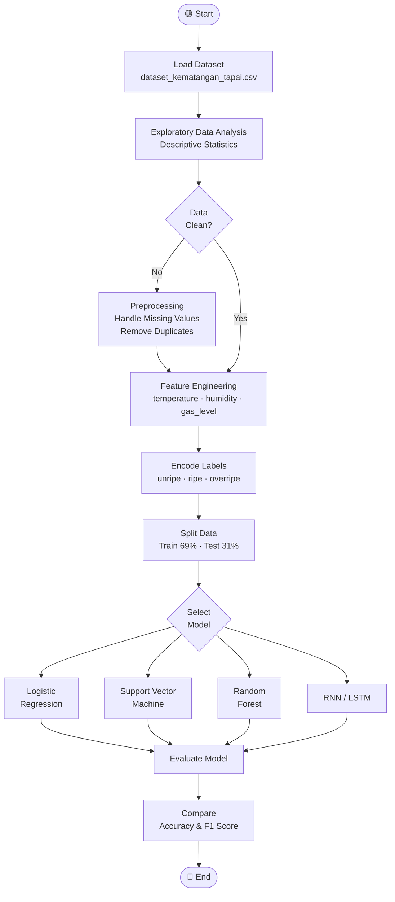
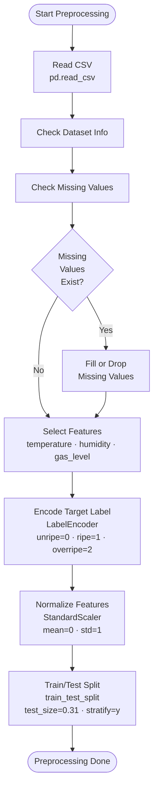
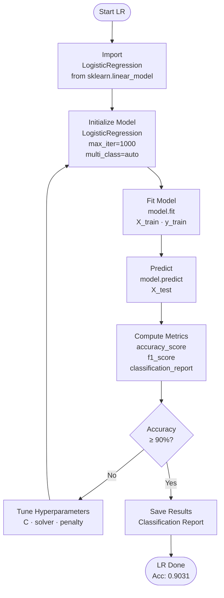
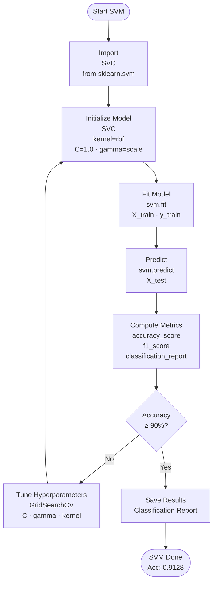
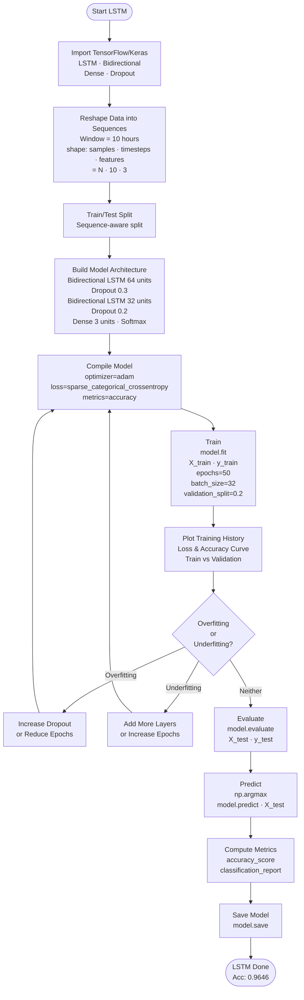
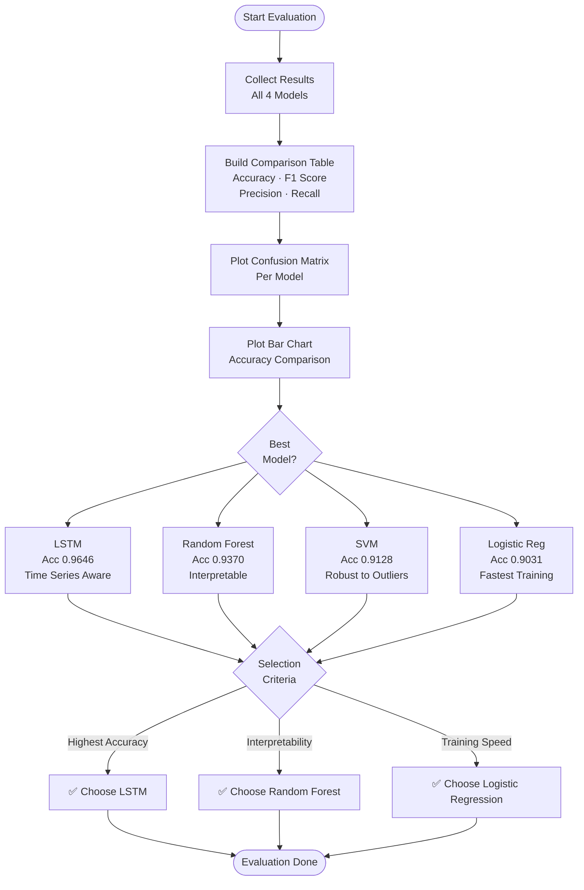

# Training Implementation Flowchart — Cassava Tapai Ripeness Prediction

The flow of this research is carried out as illustrated in the flowchart below. There are 4 models that will be used in this research, namely Logistic Regression, Support Vector Machine (SVM), Random Forest, and LSTM (Long Short-Term Memory). These four models were selected because they represent different architectural characteristics in terms of linearity, kernel-based transformation, ensemble learning, and temporal sequence modeling. At the same time, the selection allows a comprehensive comparison between classical machine learning approaches and deep learning. After sharing the dataset, all models will be subjected to the same preprocessing and trained with various parameters. Then all models will be tested and evaluated, so that the model with the best accuracy can be determined.

---

## 1. General Overview

---

## 2. Preprocessing & Data Preparation

---

## 3. Logistic Regression Training

---

## 4. Support Vector Machine (SVM) Training

---

## 5. Random Forest Training

---

## 6. RNN / LSTM Training

---

## 7. Model Evaluation & Comparison

---

## 8. Per-Model Summary

| Stage             | Logistic Regression | SVM              | Random Forest                       | LSTM                   |
| ----------------- | ------------------- | ---------------- | ----------------------------------- | ---------------------- |
| **Input**         | `[N, 3]` flat       | `[N, 3]` flat    | `[N, 3]` flat                       | `[N, 10, 3]` sequence  |
| **Normalization** | StandardScaler      | StandardScaler   | Not required                        | MinMaxScaler           |
| **Training**      | `model.fit()`       | `svm.fit()`      | `rf.fit()`                          | `model.fit()` epochs   |
| **Tuning**        | C, solver           | C, gamma, kernel | n_estimators, depth                 | epochs, dropout, units |
| **Output**        | Linear coefficients | Support vectors  | Decision trees + feature importance | Neural network weights |
| **Accuracy**      | 0.9031              | 0.9128           | 0.9370                              | **0.9646**             |
