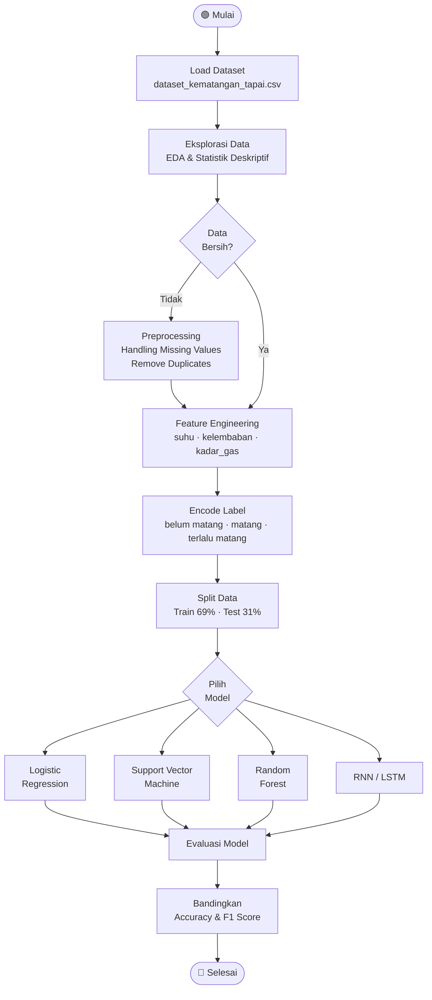
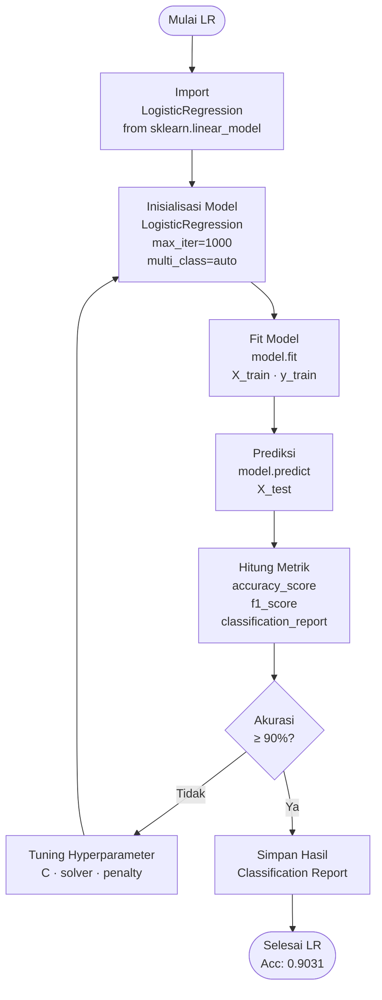
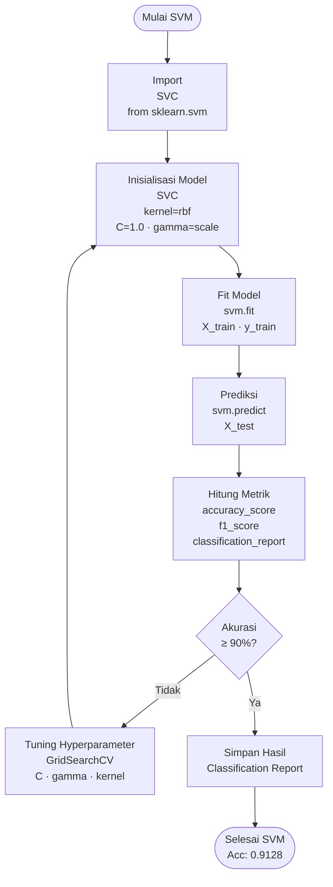
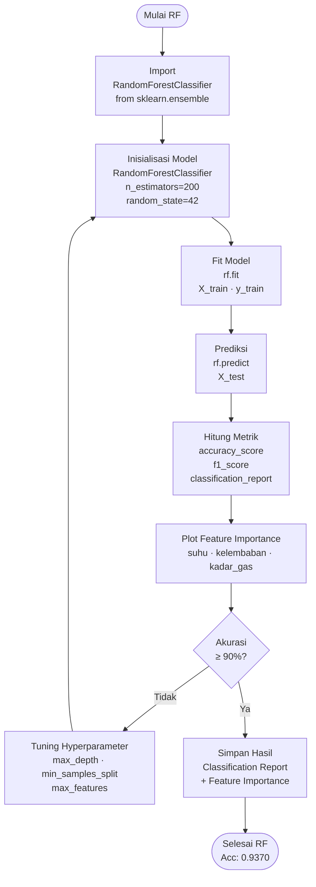
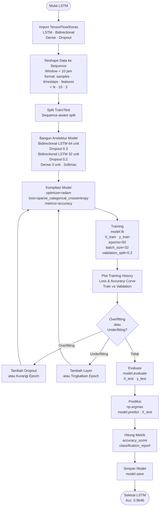
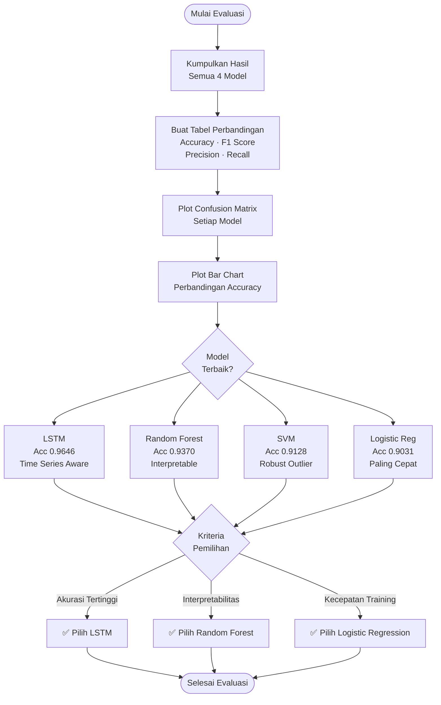

# Flowchart Implementasi Training — Prediksi Kematangan Tapai Singkong

Dokumen ini menggambarkan alur implementasi training untuk keempat model machine learning yang digunakan dalam klasifikasi kematangan tapai singkong berdasarkan data sensor suhu, kelembaban, dan kadar gas fermentasi.

---

## 1. Alur Umum (Overview)



---

## 2. Preprocessing & Persiapan Data

```mermaid
flowchart TD
    A([Mulai Preprocessing]) --> B[Baca CSV\npd.read_csv]
    B --> C[Cek Info Dataset\ndf.info · df.describe]
    C --> D[Cek Missing Values\ndf.isnull().sum]
    D --> E{Ada\nMissing\nValues?}
    E -- Ya --> F[Isi atau Drop\nMissing Values]
    E -- Tidak --> G[Pilih Fitur\nsuhu · kelembaban · kadar_gas]
    F --> G
    G --> H[Encode Label Target\nLabelEncoder\nbelum matang=0 · matang=1 · terlalu matang=2]
    H --> I[Normalisasi Fitur\nStandardScaler\nmean=0 · std=1]
    I --> J[Split Train/Test\ntrain_test_split\ntest_size=0.31 · stratify=y]
    J --> K([Selesai Preprocessing])
```

---

## 3. Training Logistic Regression



---

## 4. Training Support Vector Machine (SVM)



---

## 5. Training Random Forest



---

## 6. Training RNN / LSTM



---

## 7. Evaluasi & Perbandingan Model



---

## 8. Ringkasan Alur Per Model

| Tahap | Logistic Regression | SVM | Random Forest | LSTM |
|-------|-------------------|-----|---------------|------|
| **Input** | `[N, 3]` flat | `[N, 3]` flat | `[N, 3]` flat | `[N, 10, 3]` sequence |
| **Normalisasi** | StandardScaler | StandardScaler | Tidak wajib | MinMaxScaler |
| **Training** | `model.fit()` | `svm.fit()` | `rf.fit()` | `model.fit()` epochs |
| **Tuning** | C, solver | C, gamma, kernel | n_estimators, depth | epochs, dropout, units |
| **Output** | Koefisien linear | Support vectors | Decision trees + feature importance | Bobot neural network |
| **Akurasi** | 0.9031 | 0.9128 | 0.9370 | **0.9646** |
